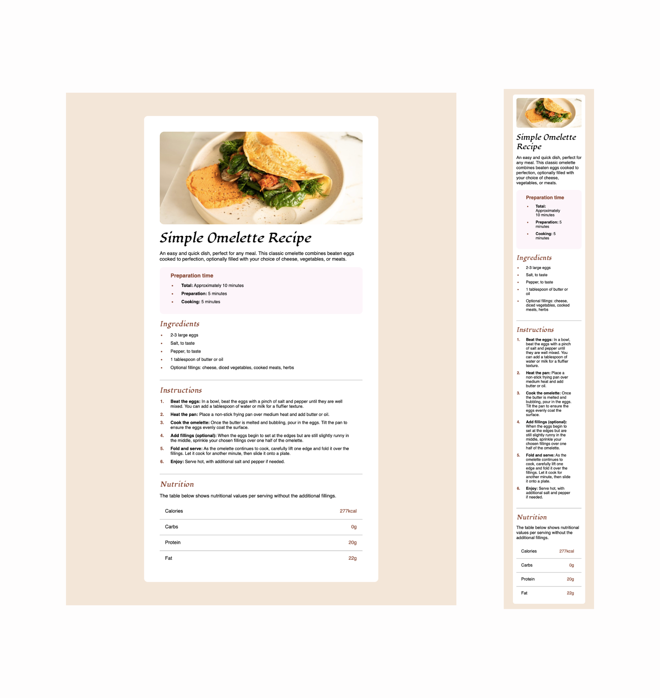

# Frontend Mentor - Recipe page solution

## Table of contents

- [Overview](#overview)
  - [Screenshot](#screenshot)
  - [Links](#links)
- [My process](#my-process)
  - [Built with](#built-with)
  - [What I learned](#what-i-learned)
  - [Continued development](#continued-development)
  - [Useful resources](#useful-resources)
- [Author](#author)
- [Acknowledgments](#acknowledgments)

## Overview

### Screenshot




### Links

- Solution URL: [Check out my solution](https://www.frontendmentor.io/solutions/resposive-mobile-using-css-flex-tools-SRBaleV3kB)
- Live Site URL: [Check out my live site](https://omowunmikamil.github.io/recipe_page.github.io/)

## My process

### Built with

- Semantic HTML5 markup
- CSS custom properties
- Flexbox
- Mobile-first workflow (Responsive website)

### What I learned

```html
<h1>Some HTML code I'm proud of</h1>
<div class="">
  <div id=""></div>
</div>
<a href=""></a>
<p></p>

<ol>
  <li></li>
</ol>
<ul>
  <li></li>
</ul>
<hr>
```
```css
li::marker {
  color: hsl(14, 45%, 36%);
}
@media only screen and (max-width: 375px) {
  img {
    width: 100%;
  }
}
```

### Continued development

I just want to continue improving my CSS skills and be better each time, till I become a proper professional web developer.

### Useful resources

- [w3schools](https://www.w3schools.com/howto/howto_css_bullet_color.asp) - This helped me add color to the bullet of the ul and ol element of my recipe page. I liked this pattern and will use it going forward.
- [w3scools](https://www.w3schools.com/html/html_responsive.asp) - This is an amazing article that helped me finally understand web responsive design. I'd recommend it to anyone still learning this concept.

## Author

- Website - [Visit my Portfolio Website](https://omowunmikamil.tech)
- Frontend Mentor - [Omowunmi Kamiludeen](https://www.frontendmentor.io/profile/@Omowunmikamil)
- Twitter - [Browser_Nerd](https://www.twitter.com/@Browser_Nerd)

## Acknowledgments
- **Frontend Mentor** - for providing README and style guide file to help bring this amazing project to life
- **w3schools** - for making web materials available for the success of the Recipe Page Challenge
